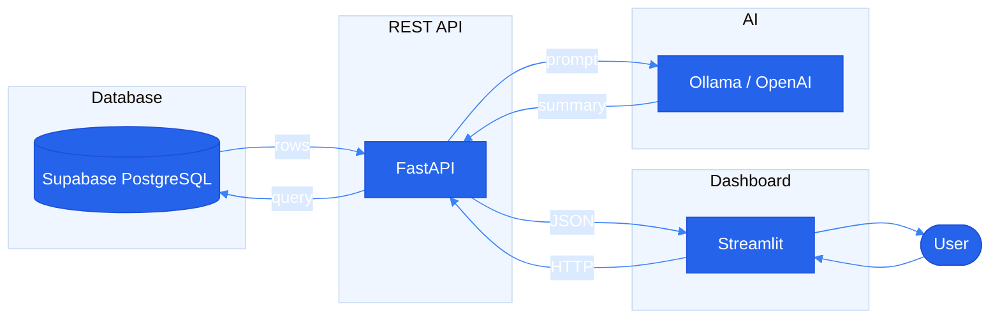

# City Congestion Tracker

City Congestion Tracker is a full-stack AI-powered traffic analytics system.
It stores synthetic congestion data in a Supabase PostgreSQL database, exposes
the data through a FastAPI backend, visualizes trends in a Streamlit dashboard,
and uses an OpenAI model to generate plain-language congestion summaries.

App link -> https://connect.systems-apps.com/connect/#/apps/e1e13984-d7db-41ea-b704-d8668a54df6c/

Please load backend if you come across read timed out error => https://city-congestion-backend.onrender.com

This project is designed for the SYSEN 5381 DL Challenge and demonstrates a
complete pipeline:

Supabase → FastAPI backend → Streamlit dashboard → OpenAI summaries.

### User & use case

**User:** City transportation staff and traffic managers who need a quick view of where congestion is building and plain-language insight without opening raw data.

**Use case:** Open the dashboard, pick a time range and optional zone/location filters, view KPIs and charts, and request an AI-generated summary that answers: which areas are worst now, how today compares to usual, and what to avoid or watch in the short term.

### System architecture & pipeline

The system follows the required pipeline: **database → API → dashboard → AI**. Data flows from Supabase through the API to the dashboard; the AI summary is produced by the API using the same data.



## Repository Structure

- `backend/` – FastAPI backend API
  - `main.py` – FastAPI app entry point and `/health` endpoint.
  - `config.py` – environment configuration and settings.
  - `supabase_client.py` – helpers for Supabase database queries.
  - `ai_client.py` – OpenAI integration for congestion summaries.
  - `schemas.py` – Pydantic models for API requests/responses.
  - `routers/` – modular API route definitions:
    - `locations.py` – endpoints for locations.
    - `congestion.py` – endpoints for congestion queries.
    - `ai_summary.py` – endpoint that calls the AI model.

- `dashboard/` – Streamlit dashboard UI
  - `app.py` – dashboard entry point with a basic placeholder page.
  - `api_client.py` – helper functions to call FastAPI endpoints.

- `scripts/` – data utilities
  - `generate_synthetic_data.py` – creates synthetic congestion datasets.
  - `load_to_supabase.py` – loads generated CSV data into Supabase.

- `data/`
  - `sample_datasets/` – example CSV datasets for testing.
  - `generated/` – synthetic datasets created by scripts.

- `docs/`
  - `codebook.md` – explanation of dataset fields.
  - `api_reference.md` – documentation of API endpoints.
  - `tests.md` – 2–3 test executions with commands and expected results.

- `infra/`
  - `schema.sql` – Supabase table definitions (run in SQL Editor first).
  - `rls_fix.sql` – Run if /locations returns empty (disables RLS).
  - `backend.Dockerfile` – Dockerfile for the FastAPI backend.
  - `dashboard.Dockerfile` – Dockerfile for the Streamlit dashboard.
  - `docker-compose.yml` – runs backend and dashboard services together.

- `requirements.txt` – Python dependencies for backend, dashboard, and scripts.
- `.env.example` – template for environment variables.

### Environment variables

| Variable | Used by | Role |
|----------|--------|------|
| `SUPABASE_URL` | Backend, load script | Supabase project URL (e.g. `https://xxx.supabase.co`). Required for DB connection. |
| `SUPABASE_KEY` | Backend, load script | Supabase anon or service role key. Use service role for load script and to avoid RLS issues. |
| `OPENAI_API_KEY` | Backend | OpenAI API key; used for AI summaries when `OLLAMA_HOST` is not set. |
| `OLLAMA_HOST` | Backend | If set, use Ollama instead of OpenAI (e.g. `https://ollama.com` for Cloud, `http://localhost:11434` for local). |
| `OLLAMA_API_KEY` | Backend | Required for Ollama Cloud. Omit for local Ollama. |
| `OLLAMA_MODEL` | Backend | Model name (e.g. `gpt-oss:20b-cloud`, `llama3.2`). |
| `BACKEND_BASE_URL` | Dashboard | Base URL of the FastAPI backend (e.g. `http://localhost:8000`). Dashboard calls this for data and AI summary. |

Copy `.env.example` to `.env` and fill in values. No external data source is required; data is synthetic and produced by `scripts/generate_synthetic_data.py`, then loaded with `scripts/load_to_supabase.py`.

## Getting Started

1. Create and activate a virtual environment (recommended):

   ```bash
   python3 -m venv .venv
   source .venv/bin/activate   # On macOS/Linux
   # On Windows: .venv\Scripts\activate
   ```

2. Create a `.env` file based on `.env.example` and fill in your Supabase and OpenAI details.

3. Install dependencies:

   ```bash
   pip install -r requirements.txt
   ```

4. **Set up Supabase**: In your Supabase project, open the SQL Editor and run the contents of `infra/schema.sql` to create the `locations` and `congestion_readings` tables.

5. **Generate synthetic data**:

   ```bash
   python scripts/generate_synthetic_data.py
   ```

   This creates `data/generated/locations.csv` (10 rows) and `data/generated/congestion_readings.csv` (1680 rows).

6. **Load data into Supabase**:

   ```bash
   python scripts/load_to_supabase.py --clear
   ```

   Use `--clear` to clear existing rows before inserting. Omit it to upsert (add or update).

7. **Run the backend**:

   ```bash
   uvicorn backend.main:app --reload
   ```

8. **Run the dashboard**:

   ```bash
   streamlit run dashboard/app.py
   ```

## Testing the API

**Test executions** (API + UI) and a **demonstration** that uses them are in **[docs/tests.md](docs/tests.md)** — see the *Demonstration* section there for how the tests show the tool working.

With the backend running you can also use:

- **Health**: `curl http://localhost:8000/health`
- **Locations**: `curl "http://localhost:8000/locations/"` or `curl "http://localhost:8000/locations/?zone=Downtown"`
- **Congestion raw**: `curl "http://localhost:8000/congestion/raw?start=2025-02-24T00:00:00&end=2025-02-24T23:59:59"`

Optional `congestion/raw` params: `location_ids=1,2,3` and `min_level=50`.

**Debug:** `curl http://localhost:8000/debug/locations-count` returns the row count in `locations`.

**If /locations returns empty:** Supabase Row Level Security may be blocking reads. In the Supabase SQL Editor, run the contents of `infra/rls_fix.sql`. Also ensure you use the **service role key** (not anon key) in `SUPABASE_KEY` for full access.

## Deployment

To deploy the **backend** and **dashboard** to a Posit Connect server (e.g. your college’s) using GitHub Actions, see **[DEPLOYMENT.md](DEPLOYMENT.md)**. It explains required GitHub secrets, the deploy order (backend first, then dashboard), and how to set `BACKEND_BASE_URL` after the backend is live.

## Using Ollama Cloud (for deployment)

To use Ollama Cloud instead of OpenAI (works on Posit Cloud, no local install):

1. Create an API key at [ollama.com/settings/keys](https://ollama.com/settings/keys).
2. Add to `.env`:
   ```
   OLLAMA_HOST="https://ollama.com"
   OLLAMA_API_KEY="your-ollama-cloud-api-key"
   OLLAMA_MODEL="gpt-oss:20b-cloud"
   ```
3. Restart the backend. If `OLLAMA_HOST` is set, the backend uses Ollama instead of OpenAI.

